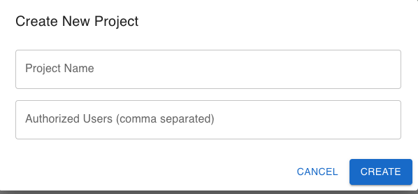

# Task 3 — Custom React Projects Page

## Overview

This project implements Task 3: Custom React App for the Cloud-Native Application Development course. The goal of this assignment was to design and implement a front-end Projects page using React that models part of a team project management UI.

### Key Features

- Authentication with sign in page and route protection
- Project Management: View and join/leave authorized projects
- Hardware Tracking: Check in/out hardware with quantity controls
- Responsive UI: Built with Material-UI components
- State Management: React component state for dynamic updates

This implementation is front-end only and uses hardcoded data in React state (no backend connection). The application demonstrates core React concepts including component composition, props, state management, and event handling.

---

## Technology Stack

| Technology | Purpose |
|-----------|---------|
| React 19.2.4 | UI framework with hooks and components |
| React Router 7.13 | Client-side routing between pages |
| Material-UI 7.3.7 | Pre-built UI components (Card, Button, TextField) |
| Create React App | Development build tool and configuration |

---

## Component Architecture

The application follows a parent-child component hierarchy optimized for reusability:

```
App
├── Router
│   ├── SignIn (Route: /)
│   └── ProtectedRoute
│       └── Projects (Route: /projects)
│           └── ProjectCard (reused ×3)
│               └── HardwareSetRow (reused ×2 per card)
```

### Component Responsibilities

**App.jsx**
- Defines routing structure
- Implements ProtectedRoute component for authentication
- Routes / to SignIn and /projects to Projects (protected)

**SignIn.jsx** (pages/)
- Simple authentication form (username/password)
- Accepts any username/password combination for testing
- Stores currentUser in localStorage
- Redirects to /projects on successful login

**Projects.jsx** (components/)
- Manages application state: projects array and users
- Implements handleToggleJoin(projectId) to modify join status
- Maps over projects array to render multiple ProjectCard components
- Provides logout functionality

**ProjectCard.jsx** (components/)
- Receives project object via props
- Displays project metadata (name, description, authorized users)
- Includes Join/Leave button that calls parent's handleToggleJoin
- Maps over hardware array to render multiple HardwareSetRow components

**HardwareSetRow.jsx** (components/)
- Receives hardware object via props
- Displays hardware name, available/checked-out quantities
- Implements quantity input field with "Check In" and "Check Out" buttons
- Updates quantity state on button clicks

---

## Task Requirements Fulfillment

| Requirement | Implementation |
|------------|-----------------|
| Use at least 2 Material-UI components | Card, CardContent, Button, TextField |
| Implement at least 2 custom components | ProjectCard, HardwareSetRow, SignIn |
| Reuse custom components multiple times | ProjectCard ×3; HardwareSetRow ×6 |
| Pass props parent → child at least 2 times | App → Projects → ProjectCard → HardwareSetRow |
| Custom event handler modifies state | handleToggleJoin() updates joined status |
| Route protection | ProtectedRoute wrapper prevents unauthenticated access |

---

## Installation & Setup

### Prerequisites
- Node.js 14+ (includes npm)
- macOS, Linux, or Windows

### Step-by-Step Instructions

**1. Clone & Navigate**

```bash
# Clone the repository (if not already cloned)
git clone <your-repo-url>

# Navigate to the project directory
cd task3-projects-page
```

**2. Install Dependencies**

```bash
npm install
```

This installs all required packages listed in package.json, including React, Material-UI, and React Router.

**3. Start Development Server**

```bash
npm start
```

The application will automatically open in your default browser at http://localhost:3000. If it doesn't, manually navigate to that URL.

Expected output in terminal:
```
Compiled successfully!

You can now view task3-projects-page in the browser.

  Local:            http://localhost:3000
  On Your Network:  http://192.168.x.x:3000
```

**4. Test the Application**

1. Sign In Page — You should see the login form
   - Enter any username and password (e.g., test / password)
   - Click "Sign In"

2. Projects Page — After authentication, view:
   - Three sample projects with descriptions
   - Two hardware sets per project with quantities
   - Join/Leave button for each project (toggles on click)
   - Check In/Out buttons for each hardware item

3. Logout — Click the logout button to return to sign-in

---

## Project Structure

```
task3-projects-page/
│
├── public/
│   ├── index.html           ← Main HTML entry point
│   ├── manifest.json        ← PWA configuration
│   └── robots.txt
│
├── src/
│   ├── App.js               ← Main app with routing logic
│   ├── App.css
│   ├── index.js             ← React DOM render entry point
│   ├── index.css
│   ├── reportWebVitals.js
│   │
│   ├── components/          ← Reusable UI components
│   │   ├── Projects.jsx     ← Main projects page container
│   │   ├── Projects.css
│   │   ├── ProjectCard.jsx  ← Individual project card (reused)
│   │   ├── ProjectCard.css
│   │   ├── HardwareSetRow.jsx  ← Hardware item row (reused)
│   │   └── HardwareSetRow.css
│   │
│   └── pages/               ← Route page components
│       ├── SignIn.jsx       ← Authentication page
│       └── SignIn.css
│
├── package.json             ← npm dependencies and scripts
└── README.md                ← This file
```

---

## Application Flow (Screenshots)

The following screenshots demonstrate the user interface and workflow of the application:

### Sign In Page


This screen shows the initial login interface with:
- Title: Hardware Management System
- Username field
- Password field
- SIGN IN button
- Demo text: "Demo: use any user and password to sign in."

No real authentication is performed; this is UI-only. Any username and password combination will authenticate successfully and store the username in localStorage.

---

### Projects Page (Main Dashboard)


This is the core screen of the application with the following structure:

Header (Top of Page):
- Left side: Page title "Projects" and greeting "Welcome, {username}!"
- Right side: Three buttons
  - REQUEST AUTHORIZATION (opens dialog)
  - NEW PROJECT (opens dialog)
  - SIGN OUT (red icon, opens confirmation dialog)

Project Cards (Center of Page):
The page displays three project cards, each with three main sections:

Left Section:
- Project name (e.g., Project Name 1, 2, 3)
- List of authorized users (comma-separated names)

Center Section:
- Two hardware sets per project (HWSet1, HWSet2)
- For each hardware set:
  - Hardware label with availability count (e.g., 50/100 checked out)
  - "Enter qty" input field
  - CHECK IN button
  - CHECK OUT button
  (These are currently UI placeholders with no backend persistence)

Right Section:
- JOIN button for projects you are not part of (white background)
- LEAVE button for the project you are currently joined to (light green background)

Visual state:
- Joined projects display with a light green background
- Non-joined projects have a white background

---

### New Project


This dialog appears when clicking the "NEW PROJECT" button and contains:
- Field: Project Name input
- Field: Authorized Users (comma separated) input
- Buttons: CANCEL, CREATE

Users can enter project details to create a new project. New projects are added to the projects list with default hardware sets (HWSet1, HWSet2). This is currently UI-only (no backend persistence).

---

### Request Authorization


This dialog appears when clicking the "REQUEST AUTHORIZATION" button and contains:
- Field: Your Name input
- Dropdown: Select Project (populated with all available projects)
- Buttons: CANCEL, REQUEST ACCESS

Users can request to be added as an authorized user to a selected project. The request appends the user's name to the project's authorized users list. This is currently UI-only (no backend persistence).

---

### Sign Out


When clicking the "SIGN OUT" button:
- A native browser confirmation dialog appears: "Are you sure you want to sign out?"
- Options: Cancel or OK
- If confirmed: User's session is cleared from localStorage and they are redirected to the Sign In Page
- The application is ready for a new user to log in

---

## Available Scripts

From the task3-projects-page/ directory:

```bash
npm start       # Runs development server (http://localhost:3000)
npm test        # Launches test runner
npm build       # Creates production-ready build in 'build/' folder
npm eject       # Exposes webpack config (irreversible)
```

### Production Build

To create an optimized production build:

```bash
npm build
```

This creates a build/ folder with minified and optimized files ready for deployment.

---

## Authentication Notes

**For Development/Grading Only**

This project implements frontend-only authentication for demonstration purposes.
- Any username and password combination is accepted
- No backend validation is performed
- Session stored in browser localStorage

Example credentials:
- Username: test, Password: password
- Username: user, Password: 123
- Username: a, Password: a

---

## Key Features & Functionality

**State Management**
- Projects and join status managed in React state
- Instant UI updates on state changes
- No page reload required

**Event Handling**
- handleToggleJoin() — Updates joined status
- handleCheckIn() / handleCheckOut() — Modifies hardware quantities
- Form submission on Sign In page

**Component Reusability**
- ProjectCard component reused 3 times (one per project)
- HardwareSetRow component reused 6 times (two per project)
- Props enable different data for each instance

**Data Persistence**
- Join status persists during session
- Hardware quantities update in real-time
- Page refresh resets to initial state

---

## Design Notes

- Hardcoded Data: All project and hardware data is defined in Projects.jsx (no API calls)
- No Backend: This is a client-side only implementation
- Material Design: Uses Material-UI for professional, responsive styling
- Responsive Layout: Works on desktop, tablet, and mobile browsers

---

## Troubleshooting

**Port 3000 Already in Use**
```bash
# Kill process using port 3000
lsof -ti:3000 | xargs kill -9

# Then restart
npm start
```

**Dependencies Installation Issues**
```bash
# Clear npm cache
npm cache clean --force

# Remove node_modules and reinstall
rm -rf node_modules package-lock.json
npm install
```

**Application Not Loading**
- Verify Node.js is installed: node --version
- Check browser console for errors (F12)
- Ensure you're in the task3-projects-page/ directory
- Try a different browser

---

## What's Included in Submission

- src/ — React components and pages
- public/ — Static HTML template
- package.json — Dependencies and build scripts
- README.md — This file
- node_modules/ — NOT included (rebuilt via npm install)

---

## Learning Outcomes

This project demonstrates proficiency in:

- React Components: Functional components with hooks
- Props & State: Parent-child communication and state management
- Event Handling: Click handlers and form submission
- Component Reusability: DRY principle in React
- React Router: Client-side routing with protected routes
- Material-UI: Professional component library
- CSS Styling: Component-scoped styles
- Authentication Patterns: Route protection and session storage

---

## Notes

- This project does not include node_modules/ in submissions (rebuilt via npm install)
- All project data is currently hardcoded (no database)
- The UI demonstrates the design but does not connect to a backend API
- This is a frontend-only implementation for demonstration purposes
- localStorage is used for simple session management only

---

## Author

Anita Woodford
University of Texas at Austin
Cloud-Native Application Development — Task 3

**Course:** ECE Cloud-Native Application Development
**Semester:** Spring 2026
**Submission Date:** February 2026
